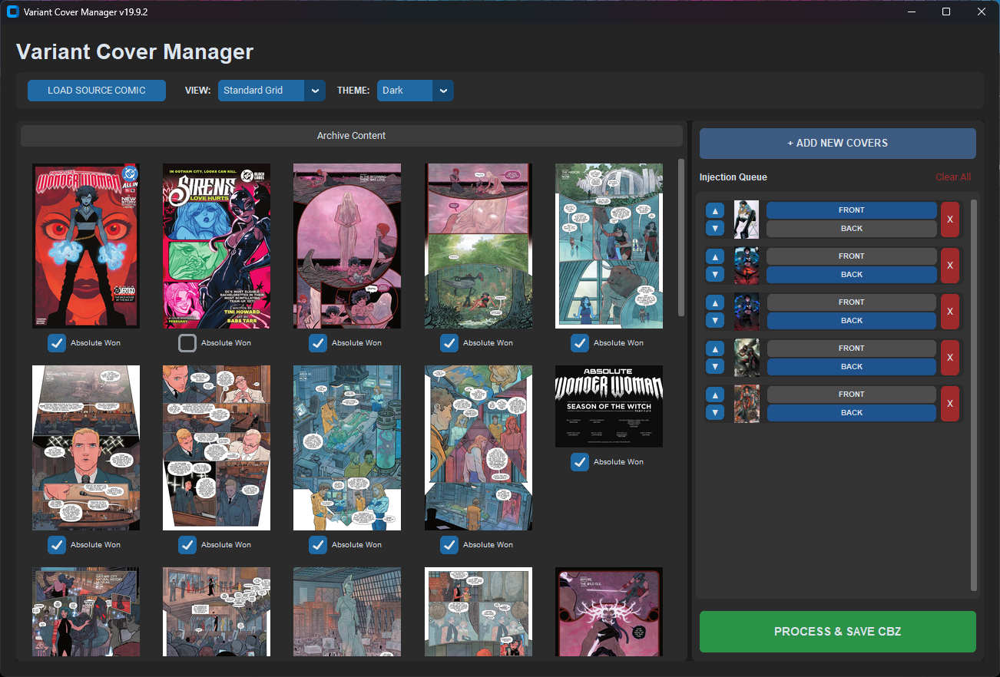

<b>Variant Cover Manager (VCM) 2.0</b>

<i>Efficient Comic Archive Management & Cover Injection</i>

📖 Overview
The Variant Cover Manager is a specialized tool for digital comic collectors. It allows you to prune unwanted pages from existing .cbz or .zip archives and inject new variant covers with perfect resolution scaling, ensuring a seamless reading experience on any device.

## 📸 Interface Preview

  

## 🚀 Key Features

Dynamic Grid Layout: A responsive archive viewer that automatically reflows based on available space.

Draggable Interface: Adjust the balance between your workspace and your queue by dragging the center divider.

Smart Resolution Scaling: Injected covers are automatically resized to match the dimensions of the original comic pages.

Smart Renaming: Automatically suggests save names based on your source file to prevent accidental overwrites.

Injection Priority: Easily toggle variants between Front (before the story) and Back (after the story).

## 🛠 User Manual
1. Loading a Source Comic
Click LOAD SOURCE COMIC in the top toolbar.

Select any .cbz or .zip file.

The app will extract the archive to a temporary workspace and display the pages in the Archive Content pane.

2. Organizing Archive Pages

Pruning: Uncheck the box under any page to exclude it from the final save—perfect for removing ads or watermarks.

View Modes: Toggle between Standard Grid and Vertical List in the toolbar.

Resizing the Pane: Click and drag the vertical bar between the grid and the sidebar to adjust your view; the grid will automatically recalculate columns.

3. Managing the Injection Queue

Add: Click + ADD NEW COVERS to select JPG, PNG, or WebP files.

Reorder: Use the ▲ and ▼ arrows to move variants up or down in the injection order.

Placement: Toggle between FRONT (beginning of the archive) or BACK (end of the archive).

Clear: Use the red X to remove a single cover or Clear All to reset the queue.

4. Saving & Scaling
Click PROCESS & SAVE CBZ.

The app automatically suggests a name ending in _v2.

Scaling Logic: The app identifies the size of original comic pages and resizes your variants to match exactly, preventing "jumping" or "black bars" when reading.

## 🎨 Personalization

Theme: Use the THEME dropdown to switch between Dark and Light modes.

The interface, including the draggable divider, will adjust to your preference.

## 📦 Technical Requirements

Python 3.10+ 

Libraries: customtkinter, Pillow (PIL) 

Permissions: Requires permission to write to a temp directory for image processing.

## 📜 Credits & License

Built By: GeneJacket 

AI Collaborator: Gemini 

License: This application is free for anyone to use, alter, and distribute. Feel free to fork the code, improve the features, and share it with the comic collecting community!